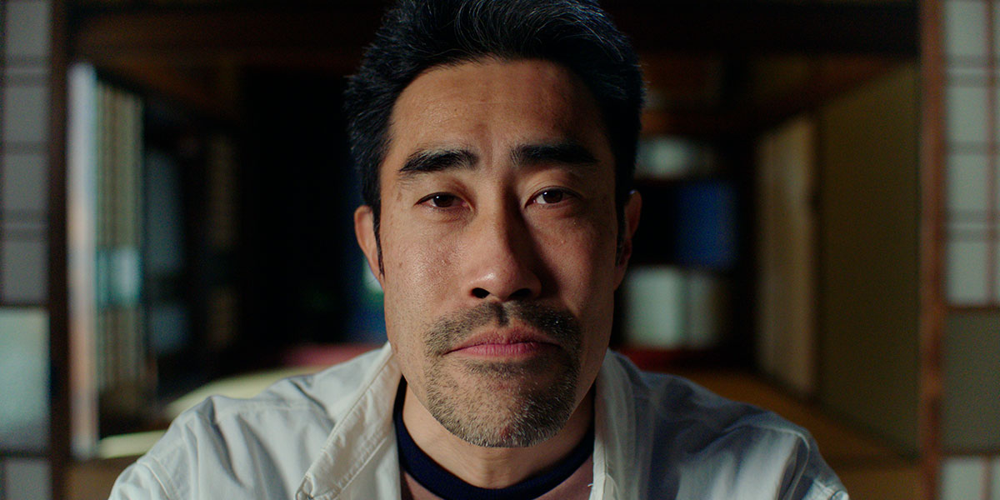
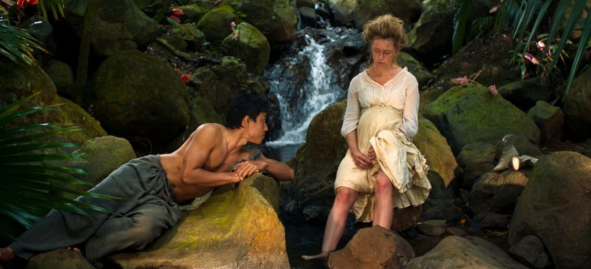

This is part 1 of 2. I saw six films this year at TIFF, and liked all of them. Pretty good batting average.

# [_Seagrass_][1]

<sl-rating value="3.5" readonly />

The 90’s setting for this film is nicely established early on when a mother hands her two daughters a crisp Canadian $2 bill to buy ice cream. They’re riding a ferry towards a summer retreat, where the parents will attend a couples workshop to mend their troubled relationship.

You can also tell it’s the 90’s from the lack of adult supervision when the two girls play with the other kids. Being of mixed race, the sisters are treated with casual racism, like when another girl tells them “you look normal even though you’re half-Japanese.” The two child actors do an excellent job of portraying their reactions to these moments; there’s nothing to do but laugh it off, but it’s a false laugh.

The younger daughter is especially compelling. She seems to be suffering from anxiety and/or depression, and it’s appropriately painful to watch.

I was hoping to see more of the adults’ therapy sessions. There are only a small handful of scenes, and some are played for laughs. I’m fascinated by watching people emerge from their emotional barriers [^1], and unfortunately, I didn’t feel like I saw enough of that in _Seagrass_.

This leads to the film’s biggest flaw for me. We are watching a couple’s relationship fall apart, and it’s suggested that one of their problems is the failure of the husband to understand and respect the wife’s Japanese heritage. But we are also introduced to, in what must be an intentional contrast, a second interracial couple who seem to be doing great (and who attend these counselling sessions as a sort of maintenance program). In creating this contrast, the movie prompts us to ask, why does one couple work, but the other doesn’t? What is it specifically about the main characters that causes conflict? I didn’t feel that the film gave us enough to satisfyingly answer these questions.

# [_The Contestant_][3]

<sl-rating value="3.5" readonly />

I remember seeing a newspaper article about the subject of this documentary when I was in high school. A popular Japanese TV show (_Susunu! Denpa Shonen_[^2]) was airing a regular segment wherein a young man was locked alone in a room, and had to apply to magazine sweepstakes in order to win prizes to feed himself. He would only be released after he won the equivalent of one million yen in prizes. By the way, he was naked the whole time. The newspaper article was funny to me, in a _hey-isn’t-Japan-wild?_ kind of way, and I brought the newspaper to school to show my friends.

This documentary is a gripping look behind the scenes of the show. We get interviews with the man, who’s known as Nasubi, and with the producer of the show. It’s certainly a much darker story than what was reported at the time. The original show was mainly played for laughs, and Nasubi’s natural goofy charisma must have been entertaining to viewers at the time. But he reveals in retrospect that he was depressed and suicidal. The way the documentary is edited, it’s hardly surprising that he struggled mentally; what he went through amounted to torture. But that’s exactly the power of film editing: the original TV show made it look like he was having a good time.

_The Contestant_ works well while it’s covering the actual events of _Denpa Shonen_. As a viewer, you don’t know whether to laugh or be angry. But I wished that it had more to say about the deeper ethical implications of what happened. The producer of the show basically gets to laugh it off, saying that he was just obsessed with making the best show he could. There’s no apology, no contrition. Nasubi for his part seems to have simply gotten over it. The documentary attempts to present his recent mountain climbing efforts as a redemptive end, but I think it’s a case of real life not providing the sense of justice and closure that we as viewers want.

# [_Sweet Dreams_][4]

<sl-rating value="3.5" readonly />

This is a story about colonialism in Indonesia in the early 1900’s. The Dutch owner of a sugar farm dies suddenly, and leaves behind the question of who will succeed him: his adult son who has travelled from the Netherlands to pick up the pieces, or the young child who resulted from an affair with the Indonesian housekeeper?

I didn’t realize this was a comedy until 15 minutes in, when a letter-writing montage is accompanied by a jaunty orchestral score that is [abruptly cut off][5] by a door opening. To be fair, the film walks the line between tragedy and comedy. The scenes about the exploited Indonesian workers are more realistic and subdued, and their plight is punctuated by comedic scenes at the expense of the wealthy white foreigners. (A subtle gag involves the pregnant wife of the landowner’s son, whose face gets increasingly blotchy with mosquito bites as the film goes on.) These scenes reminded me of the sardonic tone of _Triangle of Sadness_.

_(spoilers ahead)_

The final 15 minutes or so are mostly silent, and contains some surreal dream imagery. I had trouble understanding what was going on when I was watching it, but upon reflection, I think it comes down to the impossible choice that the housekeeper is forced into making. She can either leave behind everything she knows so that her son can have access to the wealth that was extracted from them, or she can live a modest life with her community. At first, she chooses the latter, which _feels_ like the morally right decision; but soon, we learn that violence is built into the system of colonialism, and that her freedom to choose was illusory. She’s left with no other option but to burn it all down.

[^1]:	I’m a big fan of the show [_Couples Therapy_][2], for example.

[^2]:	Translation: _Do not proceed! Crazy youth_

[1]:	https://letterboxd.com/film/seagrass-2023/
[2]:	https://www.sho.com/couples-therapy
[3]:	https://letterboxd.com/film/the-contestant-2023/
[4]:	https://letterboxd.com/film/sweet-dreams-2023/
[5]:	https://tvtropes.org/pmwiki/pmwiki.php/Main/SuddenSoundtrackStop