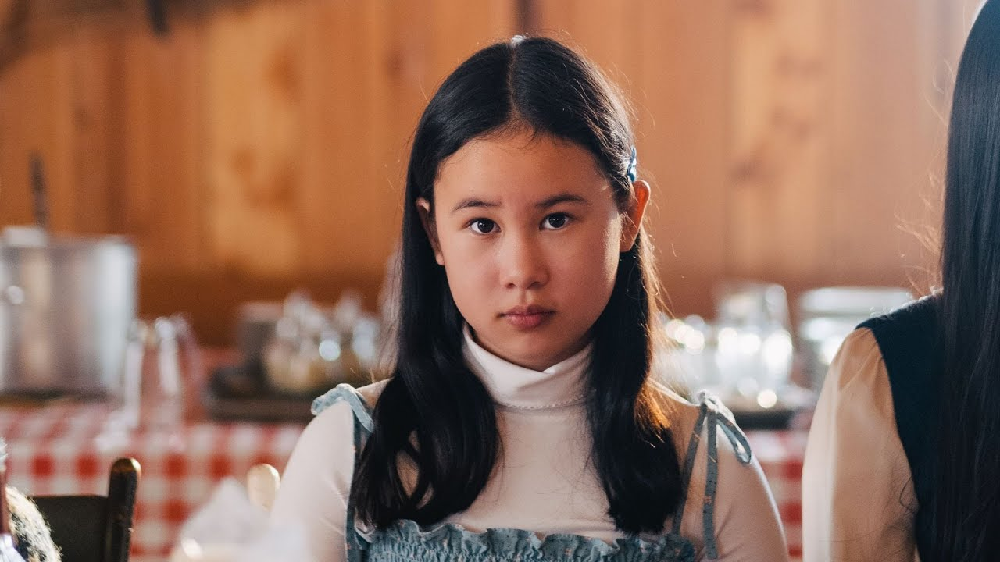
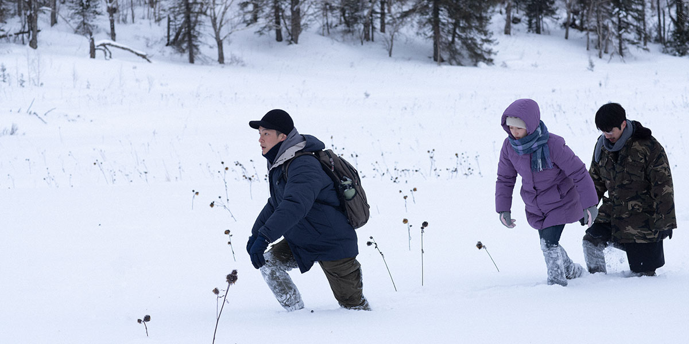
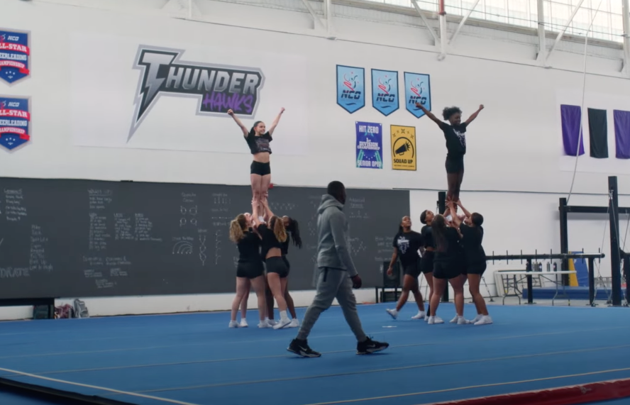

Part 2 of 2! 

(see [Part 1 here](/blog/2023-09-18-tiff-2023-1))

# [_Ru_](https://letterboxd.com/film/ru-2023/)

<sl-rating value="4" readonly />

This film follows the Nguyens, a family of Vietnamese refugees as they resettle in Quebec after fleeing the aftermath of their country's civil war. A lot rests on the performance of [Chloe Djandji](https://www.imdb.com/name/nm15036167/), who plays Tinh, the oldest child, and the main point-of-view character. At first, I wasn't impressed by her blank expression, but as the film proceeds to show us visually striking flashbacks of her and her family's difficult journey, I came to appreciate her stillness.

The rest of Tinh's family seems to be carrying on with their lives, while she remains stuck. Perhaps she alone experienced the worst of the trauma, as we see in the most memorable scene: a shocking moment where an explosion in the flashback throws debris onto the snowy schoolyard in the present.

Later in the film, the Nguyens visit the home of the Quebecois sponsors who have been helping them settle in. After a big feast, they stand outside in the snow, and the hosts sing a French folk song while the Nguyens listen. The scene felt indulgent to me. It takes the spotlight away from our main characters, and it made me realize that as a whole, the film is maybe trying too hard to sanctify the Canadian characters. Their singing didn't uplift me, but rather, made me feel like the film was flirting with ["white saviour"](https://en.wikipedia.org/wiki/White_savior_narrative_in_film) territory.

# [_The Breaking Ice_](https://letterboxd.com/film/the-breaking-ice/)

<sl-rating value="4" readonly />

_The Breaking Ice_ by Anthony Chen takes place in the Chinese city of Yanji, which borders North Korea. As the title suggests, it's a cold place. I would never choose to go there for a vacation, but the more we explore the place through the characters' eyes, the more I saw the appeal. Although the weather is unwelcoming, or perhaps _because_ it is unwelcoming, the film feels like an escape. No one wants to be there, but our main characters _need_ to be there, because they can't stand to be anywhere else.

The trio of characters is set up to be a love triangle, but it kind of stops mattering by the end. They simply enjoy spending time together, all three, and sex is secondary to friendship. They find in each other what they can't find in more populous places: acceptance beyond the expectations of family and Chinese society.

My favourite of the year.

# [_Backspot_](https://letterboxd.com/film/backspot-2023/)

<sl-rating value="3" readonly />

I attended a late-night screening, filled with young people, mainly girls. I think my viewing experience was improved by the crowd's energy as they cheered and laughed throughout.

I had watched the [_Cheer_](https://en.wikipedia.org/wiki/Cheer_(TV_series)) docuseries about competitive cheerleading, and this film is basically a fictional version of that. It's a pretty standard sports movie, including a training montage and the inevitable build-up to the big final competition, so I will just point out a few things that stood out:

- huge credit to the actors, because they are actually doing the acrobatics

- the final competition is filmed in a long take, which wouldn't be possible with stunt doubles, so again, huge credit to the actors!

- I enjoyed the electronic score, which was composed by the director D.W. Waterson, who is also a DJ

- one of the characters works at a movie theatre, and so there's a surprising amount of Cineplex product placement, which felt even more bizarre as I was sitting in a Cineplex theatre

While enjoyable, the film has one big flaw for me. Under the pressure of making the team and winning, the main character, Riley, suffers from compulsive hair-pulling and eventually panic attacks. Unfortunately, the movie fails to address these mental health issues beyond the easy trope that once you do the thing and succeed at the thing (i.e. win the cheerleading competition), then all is well and you never have to worry about it again.
