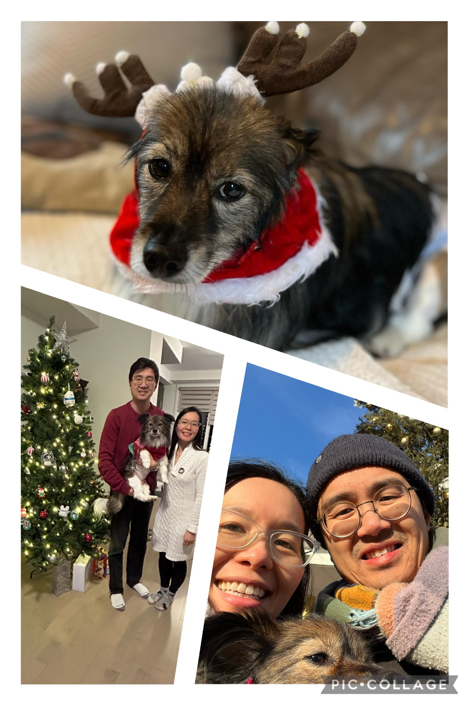

_This year, I've decided to try something new: sending a newsletter to my family and friends. My messages will be archived on this blog as well._

---

Hello! It's me, Albert. I hope you've had a restful and lovely holiday season.

You might be wondering what this message is all about. Well, I've decided to try start writing a newsletter. Don't worry, I'm not trying to sell anything. This is simply an attempt on my part to be more in touch with the people in my life who are meaningful to me.

Maybe you're someone who I haven't seen or spoken to in a while, or maybe you're someone that I hang out with regularly. In either case, if you know me, you probably know that I tend to keep to myself. _That Albert, he's a tough nut to crack,_ you might say. _A real closed book, that guy._ 

This newsletter is my way of opening the book just a little bit.

### Why a newsletter?

I got this idea after listening to a podcast[^1] where they were discussing the (declining) state of social media.

It made me think back to when Facebook first became a thing. I remember thinking: _My social life will improve immediately! They've solved the problem of friendship!_

Maybe I've had some fun interactions on Facebook over the years, but nowadays, using social media no longer feels like you're connecting with people. So I'm thinking, maybe good ol' fashioned e-mail, away from the ads and the algorithms, can help me keep in touch.

_**If your inbox is already too full, I apologize for the intrusion. I won't be mad if you unsubscribe. But more importantly, if you have any thoughts or questions for me, or just want to say hi, hit the Reply button and send me a note. I'd love to hear from you.**_

### The Actual "Content"

This newsletter is still an experiment, so I'm not sure what I'll be writing about. I’ll keep this first one short, and just share some pictures from our holiday season.

### What next?

If I never send out another one of these, then I guess you can add it to the pile of failed New Year's Resolutions. But I would really like to do this again, so here are some potential topics that you might see from me in the future:

- Our trip to Hong Kong and Japan this summer. I've been meaning to share my pictures, and was writing some code to show them in a cool slideshow on my website. I will try to get it done!
- What I do as a self-employed software developer.
- Anything else that comes to mind...

The thing that will encourage me the most to keep going with this newsletter is if I hear back from you. So, go ahead, hit Reply, and tell me how you're doing!

Happy new year!

[^1]: An interview with journalist Ezra Klein on the [_Search Engine_ podcast](https://pjvogt.substack.com/p/how-do-i-use-the-internet-now)