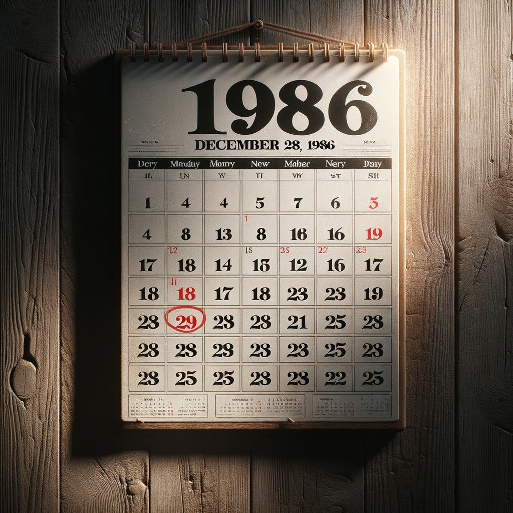

To accompany [my recent post](../quick-reviews/one-day) reviewing the book _One Day_, I attempted to use [DALL-E](https://openai.com/index/dall-e-3/) to generate an image of a calendar. The book is about events that occurred on a single day in history (December 28, 1986), and so I “engineered” the simplest prompt I could think of:

> a drawing of a calendar with the date December 28, 1986 circled

It should not have surprised me that it would fail spectacularly. I’ve followed the [_AI Weirdness_ blog by Janelle Shane](https://www.aiweirdness.com/) for a while, and I’m always entertained by the way generative AI struggles with labelling images. There’s also [this gem](https://twitter.com/skyezera/status/1778903035432870247), a generated yearbook page with hilarious names.

A calendar requires both text and numbers, and it has a structure that must make sense, which is really just too much to ask of DALL-E.

Here are some of the results:

Everyone learns in kindergarten that the five days of the week are Dans, Menday, Santer, Finglers and Trouy.

A more photorealistic attempt. It got the number of days in the week correct this time, but again, the bottom of the month has the same dates repeating for some reason. And it circled 29, instead of one of the many 28s.

There’s _wayyy_ too many days in this one, and the layout kind of reminds me of [Keno](https://www.google.com/search?q=keno+board&tbm=isch). And it forgot to draw a circle around any date.

There’s kind of an infinitely recursive structure to this one, like a fractal calendar, where each square in the month contains another month, and each of the dates in that month contains a month, _ad infinitum_.