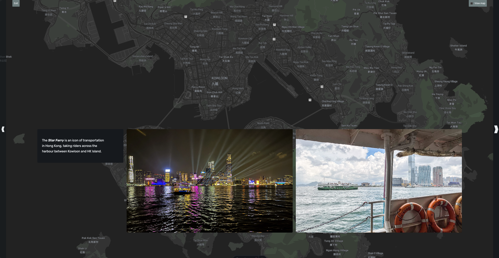

Hi! It’s me again. This is a short one to share a project that I’ve been working on for a while. About a year ago, Bev and I got the chance to travel to Hong Kong and Japan. It was an amazing experience: the opportunity to return to the city of our birth, and then to explore a completely different culture.

I like to take a lot of pictures when I travel, and I often feel that the trip isn’t complete until I edit and share the photos in some way. This time, I decided to build an interactive webpage with an animated map. Seeing how the trip happened a year ago, this is somewhat overdue—chalk up the delay to my declining software skills 😜

<!-- excerpt -->

Please, [have a look!](/2023-hk-japan) (You’ll have to use a laptop or larger monitor… mobile screens are too small to contain all the awesomeness!)

[Virtual Tour of Hong Kong and Japan](/2023-hk-japan)
