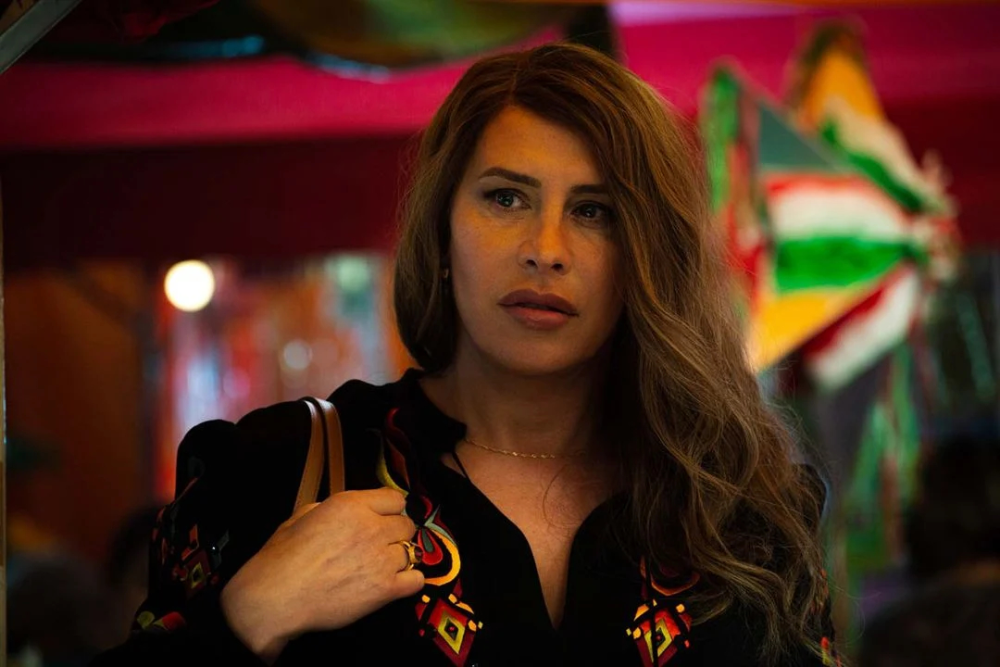
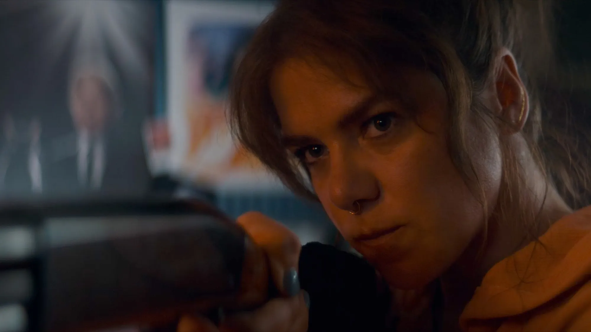

Another year, another TIFF. Before I dive into the movies that I saw, I have to comment on the increasingly frustrating ticket purchasing process. New this year, you select seats for every screening while buying the ticket. On the face of it, this has definite advantages: it’s less stressful when entering the theatre because there’s no need to rush to find a good spot, and it leaves you time to freely take that all-important pre-show bathroom break.

On the other hand, what might not be obvious is that the seat selection is not equally available to everyone. TIFF offers [paid memberships](https://tiff.net/membership) that include discounts on year-round screenings, access to a lounge in the Lightbox venue, and importantly, early access to ticket sales for the festival. Previously, it meant that members had a better chance at getting tickets for popular films, but now, with the seat selection, it means that they get to scoop up all of the best seats, too. When I purchased tickets as a non-member this year, I found that many screenings had only the worst seats left, like the first row right in front of the screen, and I decided not go to that show. In previous years, I would have just bought the ticket, and arrived early enough to find a good seat. 

The resulting feeling is that TIFF is becoming more and more exclusive, where the people who pay the most get the best experience. The festival has always played on its reputation for being the “people’s festival,” in contrast to more insider events like Cannes and Venice, but in my mind, it’s slowly losing its claim to that reputation.

End rant. 

I saw a pretty good crop of movies this year, including the top two vote-getters of the [People’s Choice Award](https://tiff.net/press/news/tiff-announces-its-2024-award-winners). Here’s a quick rundown of the films I saw, in no particular order.

## [_The Assessment_](https://letterboxd.com/film/the-assessment-2024/)

I’ll start with this one because I didn’t actually see the whole thing. I made the mistake of overindulging in a pre-show ice cream treat, and the resulting gastrointestinal distress meant that I had to leave the screening early. [I’ll watch anything with Alicia Vikander](/quick-reviews/irma-vep), and I enjoyed what I saw of her performance. In the movie’s futuristic, apocalypt-ish world, she’s the austere administrator of an assessment that all would-be parents must go through before having children. The film has a dark sense of humour and a surreal quality, and I could see it being an episode of _Black Mirror_. Looking forward to watching the whole thing sometime.

## [_Emilia Pérez_](https://letterboxd.com/film/emilia-perez/)

<sl-rating value="3" readonly></sl-rating>

In this genre mash-up, a Mexican crime boss transitions to live as a woman, and tries to atone for her past by creating a non-profit that helps the families of missing people. Why are they missing? Because they’re dead… killed by the criminal gangs that our protagonist used to lead. It’s this moral ambiguity that made the film ultimately off-putting to me. The film wishes to celebrate the redemption of this character (including throwing her a rousing parade), but I didn’t believe that justice had been done.

Even more egregious is the way she treats her family. When Emilia transitions, she abandons her wife and kids, leaving them to believe that their husband and father is dead. Later, she poses as a distant cousin of her previous identity as a way to shower love on the children, and to jealously keep tabs on her ex-wife’s new relationships. The clear deception and manipulation leads to a predictably tragic end, but the film wants us to feel all warm and fuzzy when the kids think that she “smells like papa.”

I haven’t even mentioned that it’s a semi-musical! Every few scenes, they sing and dance! I think that this element of the film saved it for me; the songs and choreography gave my audience a boost of energy. But in hindsight, I feel like the hyper-stylized presentation masks the narrative problems. It’s hard to think through some of the movie’s more harmful messages when you’re busy bopping along.

## [_Seeds_](https://letterboxd.com/film/seeds-2024/)

<sl-rating value="2.5" readonly></sl-rating>

The cast of this tiny low-budget movie features a couple of my favourites from [_Reservation Dogs_](/quick-reviews/reservation-dogs): Kaniehtiio Horn (who also wrote and directed this) and Dallas Goldtooth. They play cousins who have to defend themselves and their home from a burglar, and they have a casual, jovial chemistry that’s immediately likeable.

The aforementioned burglar is after a stash of ancestral heirloom seeds, for planting the [Three Sisters](https://en.wikipedia.org/wiki/Three_Sisters_%28agriculture%29) crops. He symbolizes the real-world issue of large corporations’—such as the infamous Monsanto—ownership of seed patents, leading to the exploitation of farmers. I like that the film turns this somewhat prosaic theme, and turns it into an action thriller/revenge fantasy. The final act becomes very sadistic (spoiler: the burglar is caught and tortured graphically), which makes for a jarring tone shift.

I was reminded of Percival Everett’s [_The Trees_](https://app.thestorygraph.com/books/5e464ba9-f7a9-4d45-af8c-897632134d4f), which similarly couples witty humour with the violent revenge by an oppressed people against their white oppressors. I personally can’t bring myself to root for violence, but I understand the historical reasons for this rage and concomitant desire for vengeance.

## [_The Paradise of Thorns_](https://letterboxd.com/film/the-paradise-of-thorns/)

<sl-rating value="3" readonly></sl-rating>

This Thai film is set in a durian orchard, where a gay couple makes their living farming the fruit. When one of them dies in an accident, his husband wishes to continue the business, but because their marriage is not legally recognized, the property is inherited by the deceased man’s mother. The situation is complicated by the matriarch’s “adopted” daughter, who also wants to get her hands on the land. It becomes a battle of wills between the old woman’s son-in-law and daughter, both of whom have no official legal standing, and so must gain the mother’s favour in order to have any hope of land ownership and its associated status and wealth.

What starts off as an examination of same-sex marriage rights becomes an intense melodrama that spirals to a Shakespearean climax. It gets a little over the top, in my opinion. (Have you ever wondered what a _durian fight_ would be like?) Much of the twisty plot hinges on the motivations or perceptions thereof of the dead character, and the true history of the relationships involved is not clear enough for me to discern what is even fair in this situation.

But at the end of the day, the lead actors, Jeff Satur and Engfa Waraha, are extremely photogenic and charismatic (read: _hot_), and I enjoyed their performances.

----

[To be continued...](/blog/2024-09-20-tiff-2024-part-2)
