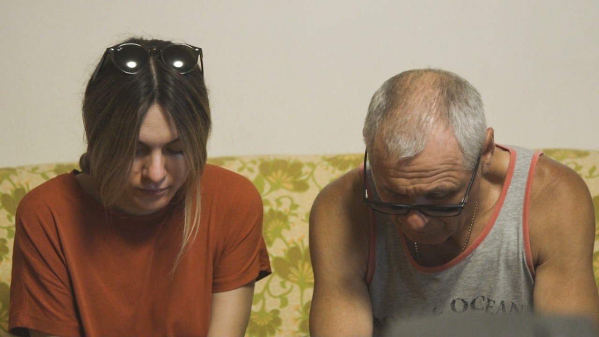
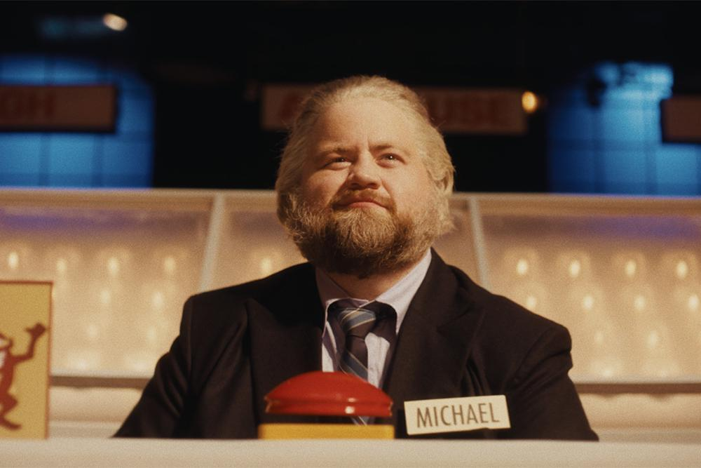
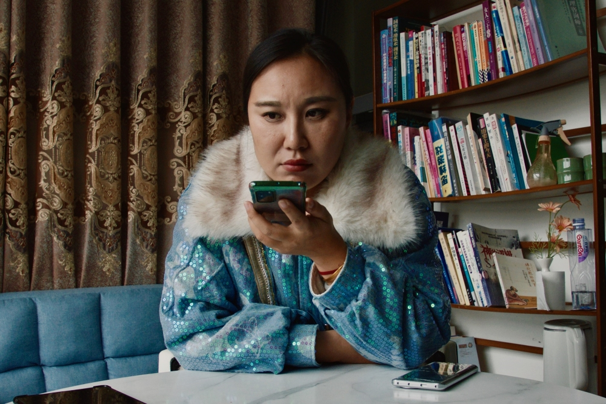

Part 2 - first part [here](/blog/2024-09-19-tiff-2024-part-1).

<!-- excerpt -->

----

## [_Tata_](https://letterboxd.com/film/tata/)

<sl-rating value="3.5" readonly></sl-rating>

This documentary was directed by a couple, Lina Vdovii and Radu Ciorniciuc, and is essentially a memoir about Lina’s family history. I was reminded of Sarah Polley’s [_Stories We Tell_](https://www.nfb.ca/film/stories_we_tell/). Both films demonstrate the immense bravery it takes to air out your family’s dirty laundry in such a public way.

In _Tata_ (Romanian for “father”), Lina’s estranged father seeks her help because he’s being abused by his boss. The irony of the situation is that he was abusive at home towards her and her mother and sister. And yet, she can’t allow him to continue suffering, even as she attempts to confront him about the suffering that he has caused her.

Underlying the personal story is a look at the broader culture of traditionally patriarchal societies where men are taught to express only strength and dominance. One scene that really blew my mind shows the father, in a moment of regret, visiting his church to make confession. The priest tells him that he did nothing wrong, and that his daughter should be grateful for his strong parenting. Even as Tata tries to make amends, and to process his own remorse, he gets pulled right back into the cultural traditions that defined him.

## [_The Luckiest Man in America_](https://letterboxd.com/film/the-luckiest-man-in-america/)

<sl-rating value="3" readonly></sl-rating>

I had seen the real-life footage of [Michael Larson’s “hack” of the game show _Press Your Luck_](https://youtu.be/bfOm7K8A0Pw), and so when I discovered this film dramatizing those events, I was immediately intrigued.

Unfortunately, I don’t think I quite got what I wanted from the movie. I could imagine a version of this story that really dives into the procedural behind-the-scenes logistics of making a TV game show, and what happens when someone like Michael Larson throws a wrench into a smoothly running machine.

There is a bit of that in the film, but it chooses to focus on Larson’s motivations, which I felt was to its detriment. To say that he did it out of love for his family feels trite, and I didn’t buy it. The most contrived story beat comes when Larson wanders off the _Press Your Luck_ set and ends up in the hot seat on a late-night talk show, whose host just lets him voice his inner monologue about how much he loves his family, apparently while the cameras are rolling. It feels like a dream sequence, surreal to the point of unbelievability, and made me wish the film had taken a more subtle tack.

## [_The Life of Chuck_](https://letterboxd.com/film/the-life-of-chuck/)

<sl-rating value="3.5" readonly></sl-rating>

I’ve been a fan of Mike Flanagan’s stuff for a while (viz. _The Haunting of Hill House_, _Midnight Mass_, _Doctor Sleep_), so I’m glad I got to see him introduce this film at my screening.

It’s hard to discuss my feelings about the film without spoiling it, so consider yourself warned. The movie has a reverse act structure, i.e. it labels its chapter headings as Act 3, Act 2, then Act 1. (I confirmed by flipping through the Stephen King text at a bookstore that this innovation comes from King’s original work.)

In Act 3, which again, is the beginning of the movie, we see the world falling apart from climate disasters, like fires and floods so bad that the entire state of California is underwater. I thought this was the most effective part of the movie, as it really played on my real-life anxieties. The characters react to their impending doom with sadness and fear but also a poignant kind of acceptance.

However, as we transition into Act 2, we find out that this dying world actually exists within the mind of Chuck, who is terminally ill; as he goes, so does his imagination. From there, we get to relive moments of Chuck’s life, including his childhood in Act 1. It’s mostly heartwarming and uplifting, especially a brilliant extended dance sequence featuring Tom Hiddleston.

But I couldn’t help but feel that the latter acts undercut the opening of the film. Evoking the tragedy of the climate crisis, and then erasing it by telling us it wasn’t real, made the story feel disconnected to me.

What I _think_ the movie was trying to say: humanity is cosmically significant, but we must find the beauty in our individual lives. What I got: humanity is cosmically significant, so let’s just forget about the world’s problems and focus on ourselves. I guess the line between affirmation and fatalism in a fine one.

## [_Mistress Dispeller_](https://letterboxd.com/film/mistress-dispeller-2024/)

<sl-rating value="4" readonly></sl-rating>

Based on my limited experience with therapy, it appears to be a profession that prefers a hands-off approach. They say that they’re not there to give advice, but rather, to guide you through self-reflection.

What we see in the documentary _Mistress Dispeller_ is like extreme therapy: the subject, Teacher Wang, is hired by wives in China whose husbands are unfaithful. Her job is to literally dispel the mistress, that is, to break up the affair. To do this, she inserts herself into her clients’ lives. For example, she instructs the wife to invite her over to dinner as a new friend, and then to pretend to be upset about the husband’s cooking, and to storm out, leaving Wang alone with the man. What results is a conversation that we would normally see in a therapist’s office—she asks him about the causes of his roving eye, and gets him to honestly reflect about his deeper needs—but what fascinated me was how she uses subterfuge and manipulation to instigate a therapy session, like throwing a surprise party for someone.

Later, she uses similar tricks to corner the mistress, leading to the insight that in an extramarital triangle, it’s the mistress who’s in the most pain, not the wife, because she _chooses_ to be in an incomplete relationship.

It definitely crosses all the boundaries of therapy as we know it in the West, but a more repressive culture like the Chinese requires a stronger hand, I suppose.
