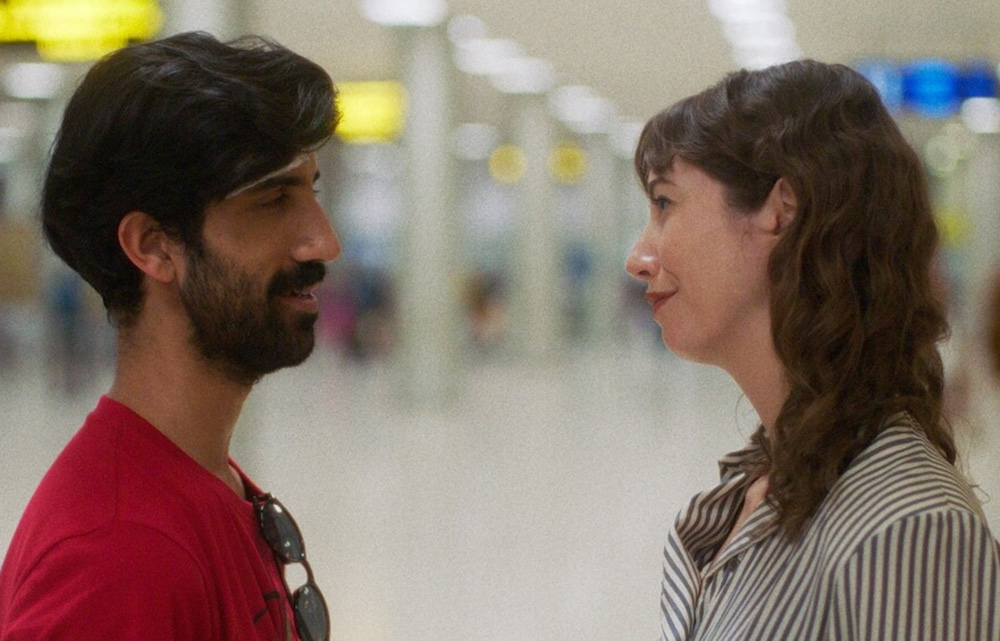

The [Reel Asian Film Festival](https://www.reelasian.com/) ran last week, and I was happy to see that they offered a digital streaming package.

I’ll be giving some brief thoughts on the films that I saw, in no particular order...

<!-- excerpt -->

## [_Ashima_](https://letterboxd.com/film/ashima-2023/)

<sl-rating value="3.5" readonly></sl-rating>

A documentary about the rock climber Ashima Shiraishi, and her goal to become, at age 13, the youngest person to complete a [V14](https://en.wikipedia.org/wiki/Grade_%28climbing%29#V-grade) boulder. (The film was shot almost 10 years ago, and I don’t really know why it’s only coming out now.) The bulk of the film shows her and her father as they travel to South Africa to attempt the climb. The boulder itself resides in the wilderness, which is captured by some beautiful scenic cinematography. A lot of drama is mined from the way her father pushes her—arguably to the point of bullying—to keep trying even as she repeatedly falls and injures her hands. You can debate whether the Japanese style of high-pressure parenting is “right” or “wrong”; I will refrain from judgement, but it makes for compelling and sometimes uncomfortable viewing.

## [_Nikah_](https://letterboxd.com/film/nikah/)

<sl-rating value="3" readonly></sl-rating>

Shows life in the [Uyghur region of China](https://en.wikipedia.org/wiki/Xinjiang) through the perspective of a young woman. There’s pressure from the community for her to settle down and find a husband, but she hasn’t met any prospects that she likes. The story is quite simple, but I appreciated a look into a culture that I haven’t seen before. In the background of it all is the fear of persecution from the Chinese government. There are signs all over town prohibiting certain types of dress and religious rituals. The dread is most effectively conveyed by a couple of shots from the POV of a surveillance camera, where every face in the crowd is [tracked and identified](https://en.wikipedia.org/wiki/Facial_recognition_system).

## [_Lucky Star_](https://letterboxd.com/film/lucky-star-2024/)

<sl-rating value="2.5" readonly></sl-rating>

A family drama about a father who gets into financial trouble after a [CRA phone scam](https://www.canada.ca/en/revenue-agency/corporate/scams-fraud/recognize-scam.html), and tries to dig himself out of it by playing in underground gambling dens. I wasn’t really engaged by this one; it’s competently made, but fell a little flat. I understand that gambling addiction is a mental illness, but I don’t think the film deals with it as such, and so it just felt like watching someone repeatedly getting himself into trouble for no good reason.

## [_Ben and Suzanne, a Reunion in Four Parts_](https://letterboxd.com/film/ben-and-suzanne-a-reunion-in-4-parts/)

<sl-rating value="4" readonly></sl-rating>

I hesitate to make this comparison because I’m not that familiar with Richard Linklater’s films, but I don’t think it’s a big stretch to say that _Ben and Suzanne_ follows the template of the [_Before_ trilogy](https://en.wikipedia.org/wiki/Before_trilogy). We follow a couple who have been living apart, as they reunite in Sri Lanka for a vacation. Both actors are charismatic and naturalistic, and the dialogue is witty. As with any couple, their worldviews aren’t always fully in sync, and the suspense of watching their conversations throughout film comes from the question: is _this_ the philosophical disagreement that becomes the dealbreaker for them? At the same time, they do genuinely care for each other and make each other happy, so you root for them, despite their conflicts. My favourite of the festival.

## [_Home Court_](https://letterboxd.com/film/home-court/)

<sl-rating value="3.5" readonly></sl-rating>

Another sports-themed documentary, this one following high-school basketball star Ashley Chea, as she tries to lead her team to some kind of regional or state championship. Unfortunately, the structure and stakes of the various tournaments were not super clear to me, and the film gets a bit repetitive in the final third, as it becomes a series of highlight reels for game after game. The most compelling moments come from watching Ashley’s personality mature as she learns how to be a role model as the team captain. The film also attempts to create an emotional arc from the strained relationship between Ashley and her mother, but I don’t think it really worked. Unlike _Ashima_, you never really see the tension between them, and so the final reconciliation feels forced.

## [_The Land of Morning Calm_](https://letterboxd.com/film/the-land-of-morning-calm/)

<sl-rating value="3" readonly></sl-rating>

Takes place in a Korean fishing community, where one of the fisherman hatches a plan: he will disappear into the night, and his cantankerous boat captain will report that he was lost at sea. As a result, his wife and mother will get his insurance money. It’s a pretty shaky premise for me, because 1) it depends on the captain to keep the secret and live a lie, and 2) I can’t believe that anyone would willingly put his family through such emotional pain, even if they get financially compensated. The best parts of the film for me have nothing to do with this ridiculous scheme, but rather with the day-to-day conflicts that arise from the business of fishing. (See also: [_CODA_](https://letterboxd.com/film/coda-2021/).)
