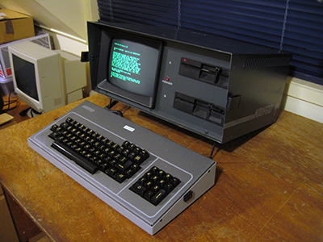
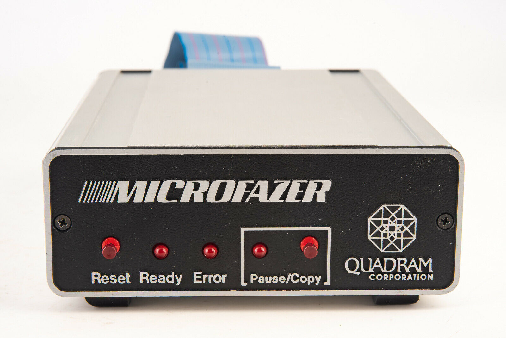
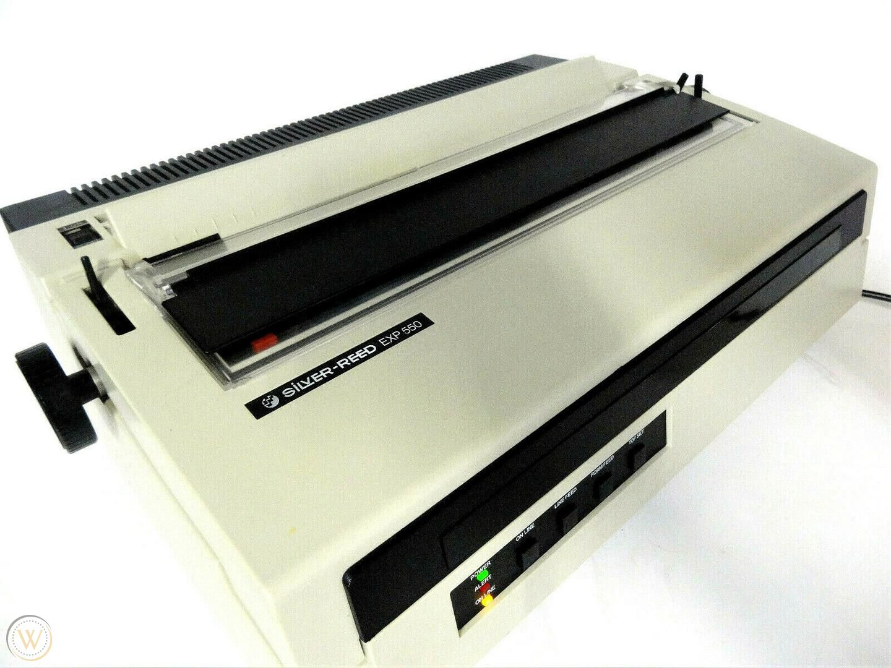
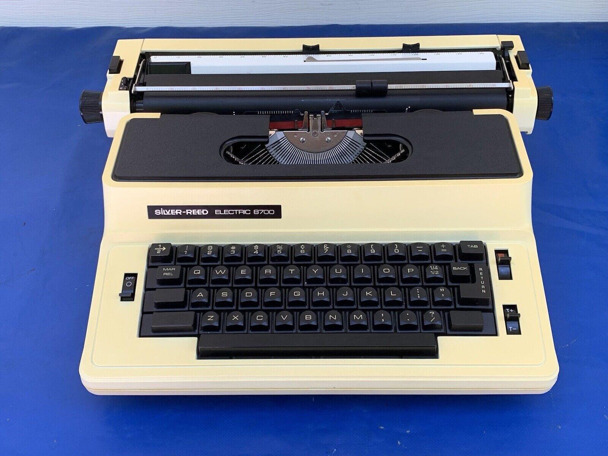
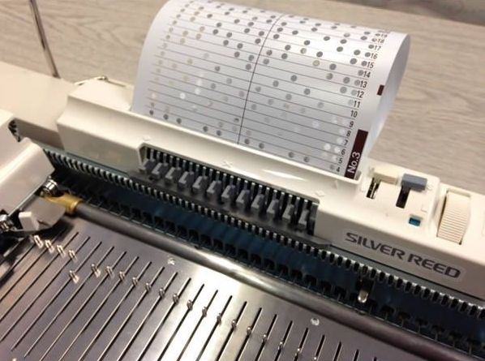

Recently, I picked up a book called [_Loose Cannons, Red Herrings, and Other Lost Metaphors_][2] by Robert Claiborne, apparently containing etymologies of words and phrases. I’ll say nothing further about the book itself, because I haven’t read it yet, but while I was flipping through it, something caught my eye on the Acknowledgements page.

The first half of the Acknowledgements is the standard “thank the editor, I love my family” type of thing. The second half, though… well, I’ll just quote it.

(Oh, important to note: this book was first published in 1988.)

> The manuscript for this work was written on a Kaypro 4 microcomputer, using the Perfect Writer (Version 1.20) word-processing program, with Plu\*Perfect and Smartkey II enhancements. The printout was made on a Silver-Reed EXP 550, linked to the computer through a Quadram Microfazer 64K buffer. The master list of metaphors from which I worked was alphabetized with SORT, a public domain program given to me by M.E. Thornsberry of San Antonio, Texas.

 The author must have been a computer geek, eager to show off his technological _bona fides_. I got a kick out of it, and then proceeded to fall into a rabbit hole of looking up all of these gadgets that I’d never heard of.

Here’s what I found out:

### Kaypro 4 microcomputer

Kaypro was one of the top personal computer manufacturers in the 80’s, but eventually went away once IBM and its clones took over. The Kaypro 4 of 1984 is not to be confused with the Kaypro IV, which came out a year earlier. [According to Wikipedia][3], “Kaypro's nomenclature was odd, with the numerical designations for their machines having more to do with the capacity of the drives than the order they were produced.”

### Perfect Writer

A word processor that was descended from another piece of software called [MINCE][4], which itself was descended from the legendary (and still-kicking) [Emacs][5]. In classic geek style, the acronym MINCE playfully stands for “MINCE is Not Complete Emacs.”

I was really curious about what the “Plu\*Perfect” and “Smartkey II” enhancements did, but couldn’t find anything on the subject.

### Quadram Microfazer

Apparently, this is a thing that you hook up between a computer and printer, which provides extra memory. Back then, if you had to print something big, it would tie up your computer while you waited for the pages to come out. With the Quadram Microfazer, you could send the document to the device, and then work on something else instead. According to [this review][6] published in 1983,

> One article I wrote recently was 4178 words long. A double-spaced printed version ran 17 pages and took 11 minutes and 40 seconds to print (about 40 seconds per page) on an Epson MX-80 printer… On the three printouts of this article, the MicroFazer saved 35 minutes of computer time, a significant saving indeed.

### Silver-Reed EXP 550

Can’t you just hear the noise that this printer would make?

When I Googled “Silver-Reed,” a bunch of typewriters came out, along with… knitting machines. I believe the typewriters were made by the same company as the printer, which is a sensible pivot to make. Indeed, if you look at the logos, the typography matches.

I thought the knitting machines might also be made by the same manufacturer, because the punch-card knitting patterns make it seem computer-y, but it doesn’t look like the typography matches here.

In any case, enjoy this [cool video][7] of the knitting machine in action!

### M.E. Thornsberry

I couldn’t find anything about this person. They and their `SORT` program are lost to time. Rest well, M.E. Thornsberry.

[2]:	https://app.thestorygraph.com/books/9eeaa732-0e04-49f8-88f5-daea68ab1a75
[3]:	https://en.wikipedia.org/wiki/Kaypro#Kaypro_by_model_and_year
[4]:	https://en.wikipedia.org/wiki/MINCE
[5]:	https://www.gnu.org/software/emacs/
[6]:	https://www.atarimagazines.com/creative/v9n3/64_Quadram_MicroFazer_Data_B.php
[7]:	https://www.youtube.com/watch?v=HfmbFDTY5eQ