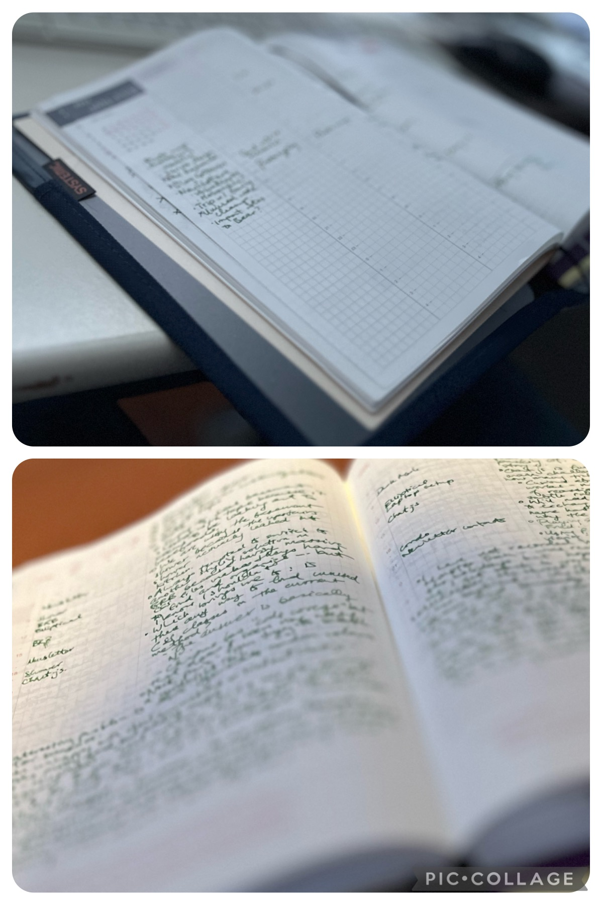

Hello, all! It’s me again. Thank you for those who replied with encouraging words last time. I hope you’ll find my latest thoughts interesting. Please read on!

<!-- excerpt -->

### An Unexpected Discovery from Japan

When we went to Tokyo last year, we surprised ourselves by spending a disproportionate amount of time inside stationery stores. Bev and I are both nerds when it comes to stationery: she’s into the many varieties of pens, and I like paper products.

As tourists, you’d think we would visit sites that have significance to Japanese culture. But as it turns out, quality stationery _is_ a [significant part](https://youtu.be/Cq6mP-WfikI) of Japanese culture. Most malls and department stores have stationery sections, with a much more wide-ranging selection than we’re used to here in Canada. If you’ve only been to Staples or Indigo, nothing will prepare you for the 12-story [Itoya](https://whenin.tokyo/Itoya-Stationary-Ginza) in the Ginza district.

As mentioned, I have an affinity for notebooks, and planners in particular. What can I say, I like to stay organized the old-fashioned way. In 2023, I was using a [Leuchtturm1917 weekly planner](https://www.leuchtturm1917.ca/weekly-planner-and-notebook-english.html), and it was serviceable, but didn’t quite suit my needs. Because we visited Japan in the summer, I didn’t see many planners in stores (they’re sold towards the end of the year, for use starting in January). So when November came around, I found myself mentally travelling back to Tokyo, wishing I could see what they had to offer.

Thanks to online shopping, I discovered the [Hobonichi Techo]( https://www.1101.com/store/techo/en/2024/pc/detail_cover/cb24_jan_en/), and never looked back. It combines a weekly planner and a daily journal, and the page layouts are beautifully designed. The quality of [the paper](https://www.galenleather.com/blogs/news/tomoe-river-paper) is almost magical: silky smooth, able to hold fountain pen ink, but light and thin enough that I can carry its 500+ pages without feeling like I’m lugging around a Tolstoy novel.

I’ve been into journalling for some time, but I never did it as often as I wanted to. With the Hobonichi’s daily format, it encourages me to write something down everyday, because there’s nothing sadder than a wasted empty page.

Let me know: Do you use anything for day-to-day planning or journalling? Do you have any favourite pieces of stationery? (I haven’t even mentioned my favourite pen. Maybe another time.)

### A “Secret” Revealed

One of the first books I read this year was [_Humankind: A Hopeful History_]( https://app.thestorygraph.com/books/9a3bf034-0cec-4d40-b473-17e644f35ebf) by Rutger Bregman. Check out [my review](/quick-reviews/humankind) for a more in-depth summary, but suffice it to say, the message of the book has been on my mind ever since I read it. I’ve really tried to adjust my perception to assume that people’s intentions are generally good.

One lesson that stuck with me is the idea that we should spread the word about our good deeds. While I don’t exactly keep it a secret, I’ve tended to avoid talking about my volunteer work. Or I might tell people, “I do it because I enjoy it,” as if its purpose is to entertain myself. I have this belief, misplaced perhaps, that charity requires humility, and that if I draw attention to my altruism, then I’m somehow being a jerk.

But according to Bregman, hiding our good deeds only reinforces the idea that people are selfish.

> Modern psychologists have discovered that when people do something out of the goodness of their hearts, they often fabricate selfish motives… As one American psychologist notes, “People seem loathe to acknowledge that their behaviour may have been motivated by genuine compassion or kindness.”
>
> Unfortunately, this reticence works like a nocebo. When you disguise yourself as an egotist, you reinforce other people's cynical assumptions about human nature. Worse, by cloaking your good deeds, you place them in quarantine, where they can't serve as an example for others.
>
> - Rutger Bregman

So, I’m here to tell you a little bit about my experiences in the past year. On most weeks, I participate in the [Canadian Cancer Society’s Wheels of Hope program](https://cancer.ca/en/living-with-cancer/how-we-can-help/transportation). I pick up patients from their homes and drive them to their appointments at various hospitals. During their appointment, I wait at a nearby coffee shop, or take a walk in the park, or just have a good sit in the car. When they’re done, I take them home.

As I write this, I still have a nagging feeling that I shouldn’t be bragging. I hope it doesn't come across that way. My goal is to spread awareness, not about myself, but about the positive acts that we can do in our communities.

In that spirit, I’d like to hear about any charitable causes or volunteer work that you might be involved with. Hit Reply and let me know!
